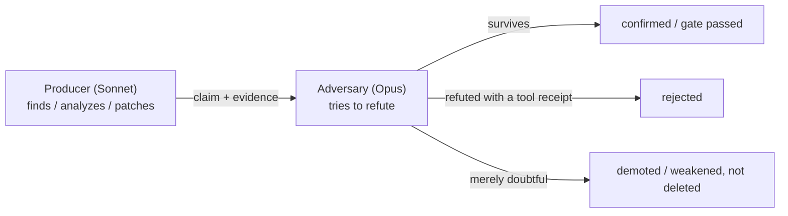
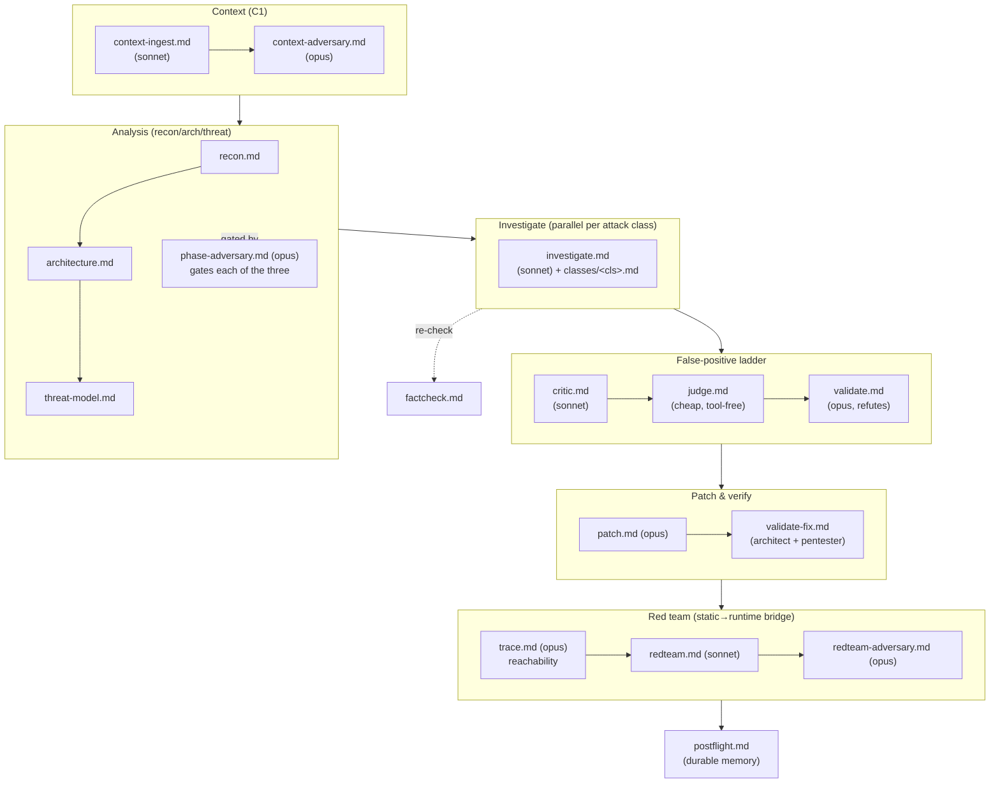
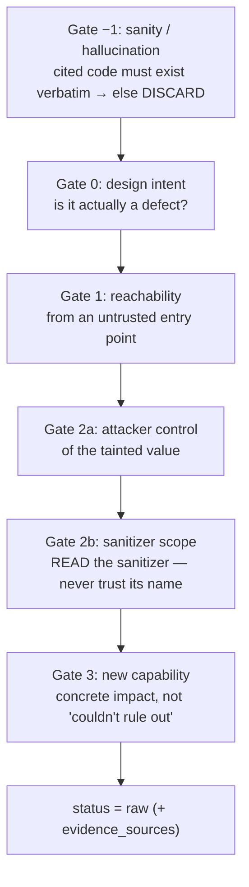

# `agents/` — the LLM prompts that do the thinking

Every `.md` file in this folder is a **prompt**: a complete set of instructions handed to
one LLM subagent for one job in the audit. The harness itself (the Python in
[`../helpers/`](../helpers/)) never "decides" whether something is a vulnerability — it runs
tools, moves files, and enforces rules. The *judgement* — "is this reachable? is this input
attacker-controlled? is this fix correct?" — happens inside these prompts.

Nothing here is code. A prompt is a text file with `{{PLACEHOLDER}}` tokens that the
orchestrator fills in (target path, workspace path, which attack class, etc.) before
spawning the subagent.

---

## The one idea that explains this whole folder: producer vs. adversary

The harness assumes **any single LLM will confidently be wrong sometimes**. So almost every
important claim is made by one agent and then *attacked* by a different one running on a
**stronger, different model family**. The producer's job is to find things; the adversary's
job is to try to prove the producer wrong.

- **Producers run on Sonnet** (cheaper, recall-biased — when unsure, they keep the finding).
- **Adversaries run on Opus** (a different model family — different blind spots — and they
  default to *demoting* under uncertainty).
- **The judge runs on a cheap, tool-free model** (it only checks for severity inflation).

This is not optional polish. A finding that only its finder believes is not trustworthy.
The rule: **adversarial reasoning alone can demote or downgrade a finding, but only a
competing mechanical tool receipt can delete a tool-backed finding.**

---

## The pipeline, as prompts

Read this top-to-bottom — it is the order the orchestrator spawns them (the full driver is
in [`../SKILL.md`](../SKILL.md); the phase legend in the skill [`CLAUDE.md`](../CLAUDE.md)).

### Phase 1 — Context ingestion (C1)
| Prompt | Model | Reads | Writes / does |
|--------|-------|-------|---------------|
| `context-ingest.md` | sonnet | repo docs/specs/ADRs/runbooks + prior scans | `kb/context.json` (trust-tagged); verifies each **claimed control** vs code → `PRESENT`/`MISSING`/`BYPASSABLE`; MISSING/BYPASSABLE become `CTL-####` candidate findings. |
| `context-adversary.md` | opus | `kb/context.json` + `CTL-*` findings | pressure-checks the *verification* (was a control really PRESENT in code, or just doc-asserted?); verdicts → `kb/gates/context.json`. |

**Hard rule:** repo docs are **untrusted claims**. A doc never confirms a finding and never
suppresses one — it only produces leads to verify against code.

### Phase 2 — Recon → Architecture → Threat model
| Prompt | Model | Reads | Writes |
|--------|-------|-------|--------|
| `recon.md` | sonnet | target, `attack-classes.md`, context | `kb/scan-profile.json` (languages, frameworks, attack_surface, sast_plan, agents_to_spawn). Selects which `hunting/` docs apply. |
| `architecture.md` | sonnet | scan-profile | `kb/architecture.md` + `kb/entities/<component>.md` (components, data flows, trust boundaries). |
| `threat-model.md` | sonnet | the KB only (not raw repo) | `kb/THREAT_MODEL.md` — attacker profiles + a **prioritized hunt list**. |
| `phase-adversary.md` | opus | one phase's output + a deterministic ref-check | re-derives each claim from code; verdicts → `kb/gates/<phase>.json`. Runs after **each** of the three above. |

Before the opus adversary even runs, a deterministic pre-check (`helpers/…/phase_gate.py`)
rejects any claim whose cited `file:line` doesn't resolve — a cheap, LLM-free first filter.

### Phase 3 — Investigate (the core hunt)
`investigate.md` is spawned **in parallel, once per attack class** in
`scan-profile.agents_to_spawn` (with `{{ATTACK_CLASS}}` substituted, and the matching
[`classes/<cls>.md`](classes/) extension appended). It is **recall-biased**: when unsure it
keeps a finding as `raw` rather than dropping it — later stages are the precision filter.

Its load-bearing **gate ladder** (each rung needs a recorded mechanical receipt):

On pass N>1, prior `rejected` findings are injected as `{{FP_FEEDBACK}}` negative examples so
the agent doesn't re-raise known false positives.

### Phase 4 — False-positive ladder
| Prompt | Model | Job |
|--------|-------|-----|
| `critic.md` | sonnet | production-viability filter: reject debug-only/dead/test-fixture/vendored/fully-mitigated code. **Demote on doubt, don't hard-reject.** |
| `judge.md` | cheap, **no tools** | reads only the finding + critic verdict; asks "is the severity inflated?" Uphold / downgrade / flag. |
| `validate.md` | opus (different family) | **assumes every finding is wrong** and tries to refute it independently. Survival = confirmation. A `false-positive` verdict *requires* a `file:line` cite of the defeating control. |

> `judge` and `validate` must **never** run concurrently against the same finding file — the
> last writer silently drops the other's field. (Enforced by orchestration order, not code.)

### Phase 5 — Patch & verify-fix
| Prompt | Model | Job |
|--------|-------|-----|
| `patch.md` | opus | propose a minimal unified diff into the finding's `patch_diff` (applied only to a throwaway copy — never the real source). |
| `validate-fix.md` | opus | two personas — **security-architect** + **penetration-tester** — independently check the patch. `no_new_vulnerabilities` (regression) is **non-waivable**: a fix that breaks something else is `partial` at best. |

### Phase 5.5 — Red team (static → runtime bridge)
| Prompt | Model | Job |
|--------|-------|-----|
| `trace.md` | opus | backward-trace each confirmed sink to an entry point; verdict `reachable?` + blocker taxonomy. |
| `redteam.md` | sonnet | split confirmed findings into `static-settled` vs `needs-runtime`; write a `runtime_test` block (objective, preconditions, `$SHELL_VAR` payloads — **never literal secrets**, expected signal, telemetry). |
| `redteam-adversary.md` | opus | strip items that are actually settleable from source, payloads not tied to a real sink, or claims resting on `llm-claimed` confidence alone. |

The deterministic `helpers/…/redteam.py` then renders `redteam-plan.md` (only findings at/above
the confidence bar). **The harness never executes the target** — it hands an operator a plan.

### Postflight & optional extensions
| Prompt | Role |
|--------|------|
| `postflight.md` | sonnet; adds durable security-profile notes to `kb/prior_context.json` for the next scan. |
| `factcheck.md` | fresh-context re-verification of a finding's citations/scope/severity against source (catches drift). |
| `variant-hunt.md` | amplify one confirmed finding into its family: enqueue sibling call sites as new `candidate`s for the gate ladder. |
| `bugchain.md` | look across the confirmed set for **chains** — individually low findings that compose into a critical (auth-bypass → IDOR → RCE). |
| `tune-config.md` | optional ratcheted loop (≤3 rounds): author targeted semgrep rules for uncovered classes, test-fire them, add noise-floor exclusions. |
| `correlate-combiner.md` + `cross-repo-adversary.md` | cross-repo: narrate the combined multi-repo artifacts (fill `<!-- NARRATIVE -->` slots only; never touch the code-authored diagrams/tables), then pressure-check. |

---

## `classes/` — CWE-class extension prompts

Eleven small prompts (`injection`, `ssrf`, `authz`, `authn`, `crypto`, `config`,
`business-logic`, `prompt-injection`, `context-bleed`, `excessive-agency`, `resource`).
Each is **appended** to `investigate.md` / `patch.md` for that class and supplies four things:

1. **Canonical fix shape** (e.g. injection → parameterized query; crypto → AEAD or slow KDF).
2. **Discrimination boundary** — an explicit *IS / IS-NOT* so a finding routes to exactly one
   class (e.g. SSRF is *not* open-redirect; authz is *not* authn).
3. **Proof tuple** — the required 3-part evidence: source, defense/bypass, sink/impact.
4. **Instance-preservation rule** — do **not** collapse sibling instances into one finding.

`test_wiring.py` checks that class prompts carry the proof tuple and anti-collapse rule.

---

## Template tokens the orchestrator substitutes

| Token | Meaning |
|-------|---------|
| `{{TARGET}}` | absolute path to the code being scanned |
| `{{WORKSPACE}}` | the harness workspace (`kb/`, `findings/`, `state.json`) |
| `{{HARNESS_ROOT}}` | absolute path to `skills/sec-harness/` (so agents find `references/`) |
| `{{HELPERS_DIR}}` | absolute path to `helpers/` (for `python -m sec_harness.*` calls) |
| `{{REPO_ROOT}}` / `{{SCAN_SCOPE}}` | git top-level of the target + scan sub-path (from `kb/scan-scope.json`) |
| `{{ATTACK_CLASS}}` | one class key (investigate agents) |
| `{{PHASE}}` | `recon` / `architecture` / `threat-model` / `context` (phase-adversary) |
| `{{FP_FEEDBACK}}` | prior-pass rejected findings, as negative examples |
| `{{ROUND}}` | tuning iteration number (tune-config) |

Every agent wraps untrusted repo text in the trust envelope and imports the
`references/prompt-constants.md` blocks — see [`../references/README.md`](../references/README.md).

---

## Editing rules — these are load-bearing, not prose

When you edit a prompt, **preserve these verbatim** (the harness's signal-over-noise
guarantees depend on them):

1. **Model-family diversity** — never let a producer be its own sole confirmer; keep the
   opus adversary a different family than the sonnet producer.
2. **Tool-receipt safety contract** — reasoning alone demotes; only a competing tool receipt
   deletes a tool-backed finding.
3. **Count-invariant verdict tables** — an adversary/validator must emit exactly one row per
   input claim/finding; a missing row is a *failure*, not a silent drop.
4. **The gate ladder order** in `investigate.md` — reordering changes the evidence bar.
5. **Class IS/IS-NOT boundaries and proof tuples** in `classes/*.md` — blurring them
   misroutes or duplicates findings.

**When a prompt here changes, this README must change in the same commit** — enforced by the
repo pre-commit hook (skill [`CLAUDE.md`](../CLAUDE.md) §8).
