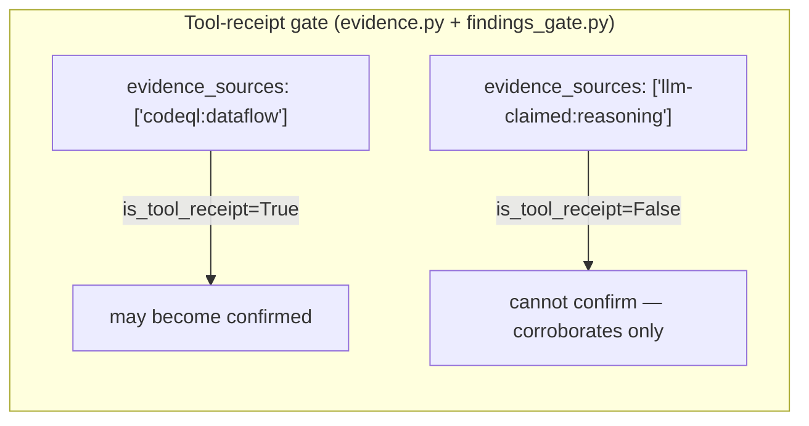

# `helpers/` — the deterministic Python core

This folder is the **machine** of the harness. If [`../agents/`](../agents/) is the
judgement (LLM prompts) and [`../references/`](../references/) is the rule book, `helpers/`
is everything that runs: it invokes the SAST tools, parses their output, moves findings
through the pipeline, enforces the gates that no LLM is trusted to enforce, and writes the
final SARIF + Markdown reports.

Two facts define this code and are true of every module here:

1. **It never runs or edits the reviewed source.** Static analysis only. Patches are applied
   to a throwaway *copy* to verify them; the target's own files are never executed or written.
2. **The core is stdlib-only.** `pyproject.toml` has **no runtime dependencies** — only dev
   deps (pytest, ruff, ty). External SAST binaries (semgrep, codeql, osv-scanner, ast-grep)
   are optional backends the code *shells out to*, not Python imports. Do not add a runtime
   dependency without a strong reason and user sign-off.

```
helpers/
├── pyproject.toml            stdlib-only; dev deps pytest/ruff/ty; line-length 100
├── sec_harness/              ~70 modules — the pipeline (this README's main subject)
│   └── correlate/            cross-repo correlation subpackage (11 modules)
├── bench/                    dev-only detection benchmark — see bench/README.md
├── tests/                    ~75 pytest files (~470 tests)
├── fixtures/                 golden JSON + a deliberately vulnerable_repo/ for tests
└── rules/                    vendored semgrep rules (git submodule) + smoke.yaml
```

---

## How to run it (development)

All commands run **from this `helpers/` directory**:

```bash
uv run pytest -q                                 # full suite (3 env-only failures — see skill CLAUDE.md §2)
uv run pytest tests/test_calibrate.py -q         # one file
uv run pytest tests/test_x.py::test_name         # one test
uv run ruff check sec_harness/ bench/ tests/     # lint
uv run ruff format sec_harness/ bench/ tests/    # format
uv run ty check                                  # static types
uv run python -m sec_harness.preflight           # check which SAST backends/packs are installed
```

The quick end-to-end smoke scan (no agents, deterministic only):

```bash
uv run python -m sec_harness.cli scan \
  --target <path-to-code> --workspace <out-dir> \
  --config rules/smoke.yaml --sha "$(git -C <path-to-code> rev-parse HEAD)"
```

---

## The pipeline these modules implement

The modules are not a flat bag of utilities — they run in a definite order during an audit.
This is the deterministic spine; the LLM agents plug in between the deterministic steps.

```mermaid
flowchart TD
    PF["preflight.py<br/>tools present?"] --> SS["scanscope.py<br/>pin repo_root + scan_scope"]
    SS --> GR["graph.py build<br/>Tier-1 substrate (LLM-free)"]
    GR --> CTX["context.py<br/>ingest repo docs"]
    CTX --> PROFILE["profile.py<br/>ScanProfile from recon"]
    PROFILE --> PRE["prefilter.py<br/>run semgrep+codeql+sca+secrets concurrently"]
    PRE --> NORM["normalize.py<br/>dedup, assign F-#### ids"]
    NORM --> PART["partition.py<br/>group candidates by attack class"]
    PART --> INV(("investigate agents<br/>(../agents/)"))
    INV --> DED["dedupe.py<br/>refactor-resistant fingerprint"]
    DED --> GATE1["findings_gate.py<br/>schema + tool-receipt gate"]
    GATE1 --> LADDER(("critic / judge / validate agents"))
    LADDER --> CAL["calibrate.py<br/>risk_score 1–10"]
    CAL --> CIT["citations.py<br/>attach ASVS/CodeGuard"]
    CIT --> PATCHV(("patch / validate-fix agents"))
    PATCHV --> VER["verify.py<br/>apply patch to COPY, re-scan"]
    VER --> GATE2["findings_gate.py"]
    GATE2 --> RT(("redteam agents")) --> RTR["redteam.py<br/>render redteam-plan.md"]
    RTR --> REP["report.py<br/>report.sarif + report.md"]
    REP --> POST["postflight.py<br/>prior_context.json (durable)"]
```



Every deterministic step records completion with `campaign.record_stage(ws, "<phase>")` so an
interrupted run can resume, and multi-pass campaigns know what's already done.

---

## `sec_harness/` — module map, grouped by job

~70 modules. Grouped so you can find the one you need. Each line is *module → what it does.*

### Data model & serialization — the frozen contract
| Module | Purpose |
|--------|---------|
| `models.py` | The `Finding` and `CampaignState` dataclasses, the `Severity` / `FindingStatus` enums, and `to_dict`/`from_dict`. **This is the schema every phase reads and writes.** |
| `evidence.py` | The tool-receipt gate. `_MECHANICAL` = {semgrep, codeql, ast-grep, tree-sitter, ripgrep, structural-index, secrets, sca}; `is_tool_receipt()` returns False for anything `llm`-prefixed; `confidence_for()` grades HIGH/MEDIUM/LOW from the strongest evidence link. |
| `schema.py` | A tiny stdlib-only JSON-Schema validator (type/enum/required/items/properties) — so schema validation needs no dependency. |

> **These two (`models.py`, `evidence.py`) are frozen contracts with the Go port.** The Go
> binary asserts byte-for-byte parity against goldens generated from them. Changing a field
> or the `_MECHANICAL` set breaks the Go build. See skill [`CLAUDE.md`](../CLAUDE.md) §1.

### SAST backends & prefilter
| Module | Purpose |
|--------|---------|
| `sast.py` | Run semgrep; map its JSON to `Finding`s. |
| `codeql.py` | Build/analyze a CodeQL DB; parse SARIF; **trust-gate** dangerous extractor/build-hook configs (`codeql_config_trusted`). |
| `sca.py` | Software-composition analysis via `osv-scanner` on lockfiles. |
| `secrets.py` | Offline distinctive-token secret patterns (github/slack/aws/…); one finding per hit. Also backs the redactor. |
| `prefilter.py` | Orchestrates the above **concurrently**, merges deterministically (sorted, `C-####` ids), applies exclusions, and is **never-silent**: every planned backend ends up in `backends_run` / `skipped` / `failed` with a reason. |
| `exclusions.py` | Evidence-backed noise-floor rules (rule_ids/globs/classes), each with a `reason`; drops are logged, never silent. |

### Attack-class routing & compliance knowledge
| Module | Purpose |
|--------|---------|
| `clsmap.py` | Single source of truth mapping CWE / semgrep metadata → attack-class key (prevents typos & orphaned findings). |
| `detection_coverage.py` | Generates `references/DETECTION_COVERAGE.md` from the live `clsmap` so the coverage doc can't drift. |
| `rule_matcher.py` | Deterministic ASVS 5.0 + CodeGuard pre-filter — attaches advisory IDs, not tool receipts. |
| `asvs.py` / `codeguard.py` | Load the ASVS JSON / CodeGuard checklists from [`../references/`](../references/). |
| `citations.py` | Auto-attach ASVS + CodeGuard citations to findings (deterministic). CLI-callable. |
| `custom_checks.py` | Discover in-repo `.sec-harness/checks/` custom-check bundles a target ships. |

### Graph & structural substrate (the "where does this reach?" engine)
| Module | Purpose |
|--------|---------|
| `graph.py` | The two-tier code graph. **Tier-1** (LLM-free): definitions + one-hop call edges + osv/secrets/crypto facts. **Tier-2**: post-prefilter CodeQL/semgrep taint merged in. Answers reachability / attacker-control / `no_path`. Persisted to `kb/graph.json`. CLI-callable. |
| `structural_index.py` | Ripgrep-backed symbol index (definitions, callers, function boundaries). CLI-callable. |
| `entrypoints.py` | Regex classification of routes / user-input / CLI args / env vars to seed Tier-1. |
| `astgrep.py` | ast-grep availability check + structural-search wrapper. CLI-callable. |
| `reachability.py` | Reachability verdict + blocker taxonomy (sanitizer/auth/validation/dead-code/flag) — the static-vs-runtime discriminator. |

### False-positive reduction & finding identity
| Module | Purpose |
|--------|---------|
| `normalize.py` | Dedup `(file, line, cls)`, keep the highest-severity survivor, assign stable `F-####` ids. |
| `dedupe.py` | Active-finding dedup; stamps the **refactor-resistant fingerprint** so a finding survives line-shift refactors across passes. CLI-callable. |
| `fingerprint.py` | The fingerprint itself: `sha256(rule_id\|cls\|enclosing-symbol)`, degrading to file:line if no symbol. |
| `findings_gate.py` | Schema-validates every finding; forbids `raw`+`duplicate_of` collisions; **enforces the tool-receipt bar** for `confirmed`/`fixed`. CLI-callable. |
| `partition.py` | Group candidates by attack class for parallel agent fan-out. |
| `fp_feedback.py` | Recycle prior-pass rejections into the next pass's investigate/critic prompts as negative examples. |
| `factcheck.py` | Post-investigation re-verification of citations/scope/severity against source. |
| `phase_gate.py` | Deterministic pre-check for analysis phases (schema + `file:line` resolution) before the opus adversary runs; writes `kb/gates/<phase>.json`. |
| `stage_validate.py` | Per-stage structured-output validation + repair contract. |

### Scoring & prioritization
| Module | Purpose |
|--------|---------|
| `calibrate.py` | Deterministic 1–10 `risk_score` for confirmed / needs-deployment-testing findings (severity base map + class boost + baseline cap + precondition gates). CLI-callable. |
| `cvss.py` | CVSS 3.1 base-score from a vector (FIRST.org formula — **never** LLM arithmetic) + an orthogonal offensive-priority axis. |
| `scoring.py` | Weighted fix-validation score (root_cause, scope_verified, …); regression is non-waivable. |
| `fix_disposition.py` | Conservative fix-completeness tier (FULL / MITIGATION / WORKAROUND); ambiguity → LLM_REVIEW. |
| `crypto_policy.py` | Machine-checked crypto policy from the two `references/approved-*.yaml` files (deny md5/sha1/des/ecb; floor rsa≥3072/pbkdf2≥600000/…). |

### Reporting
| Module | Purpose |
|--------|---------|
| `report.py` | Assemble the final `report.sarif` + `report.md`. Structure: bottom-line count block (confirmed crit/high/med/low + NDT count, never merged) → risk-ordered `## Triage` table (`_triage_row`: id/risk/what/location/status/action; the `what` clip splits on period-space so semver like `decompress@4.2.1` survives) → `## Needs runtime proof — the real leads` (NDT via `render_ndt`, foregrounded above confirmed) → `## Confirmed (source-provable)` (via `render_finding`; deps get dep-view, condensed medium/low numbered 1–4 with no gaps) → coverage/redteam-link/ledger/token-spend tail. NDT is never counted as confirmed. `_risk_sort_key` (risk desc → severity → id) orders triage, confirmed, NDT, and `select_reportable` identically. CLI-callable. |
| `sarif.py` | Emit valid SARIF 2.1.0; map severity → SARIF level. |

### Campaign, state & per-repo memory
| Module | Purpose |
|--------|---------|
| `campaign.py` | Multi-pass supervision: `record_stage`, `pass_report`, `carry_forward` (re-check settled findings on changed files). |
| `state.py` | Load/save `CampaignState`; `begin_pass` pins the SHA and increments the pass counter. |
| `repo_memory.py` | The per-repo sidecar (`<target>/.sec-harness/<slug>/`): workspace, `MEMORY.md`, dated `learnings/`, run status for resume. |
| `workspace.py` | The on-disk layout (`kb/`, `findings/`, reports); per-finding read/write; `record_agent_return` / `read_agent_return`. |
| `scanscope.py` | Resolve + pin `repo_root` + `scan_scope` once per campaign (monorepo-safe); `kb/scan-scope.json`. |
| `kb.py` | Paths to the KB files (profile/architecture/threat-model/entities). |
| `context.py` | Deterministic context ingestion (docs/specs/runbooks + prior scans), trust-tagged. |
| `profile.py` | The `ScanProfile` contract; validate/load `kb/scan-profile.json`. |
| `diffscope.py` | `changed_files(base, head)` — scope incremental passes to changed code. |
| `githist.py` | Mine git history for likely security-fix commits to seed recon/context. |
| `postflight.py` | Distill a finished scan into durable `kb/prior_context.json` (accretes, drift-keyed by SHA). CLI-callable. |

### Coverage & completeness
| Module | Purpose |
|--------|---------|
| `coverage.py` | Per-language SAST coverage accounting (dataflow vs pattern-only vs none). |
| `coverage_ledger.py` | The machine-checked completeness ledger — refuses `completeness=="complete"` while any surface `needs_follow_up`/`deferred` or open questions remain. |
| `coverage_guide.py` | Auto-stop condition for multi-pass campaigns (coverage-complete AND yield-below-threshold). |
| `discovery_ledger.py` | Loop-until-dry saturation state: stop after K consecutive waves add no new fingerprints. |

---

## Test coverage & contracts

The `tests/` folder houses ~75 files, ~470 tests. Key structural guards:
- `test_docs_invariants.py` enforces documentation contracts: prompt-constants block presence, `finding-template.md` sections (triage line, NDT-view, dep-view, reachability, renumber), and agent prompt rules (determinism, tool receipt trust, evidence chains). Regression-tested so template drift is caught early.

### Hunting aids & tuning
| Module | Purpose |
|--------|---------|
| `variant.py` | Turn a confirmed finding into deterministic search seeds for sibling call sites. |
| `bugchain.py` | Link confirmed findings that share a file/dataflow node for the chaining agent. CLI-callable. |
| `novelty.py` | Cheap git-only upstream-fix check (FIXED/UNFIXED/UNKNOWN) — no execution. |
| `rule_gaps.py` | Flag confirmed findings that no detection rule caught (hunting-only) to feed rule authoring. CLI-callable. |
| `tuning.py` | Adaptive-tuning scoreboard (did a re-tuned config strictly improve the confirmed set?). |

### Verification, safety & plumbing
| Module | Purpose |
|--------|---------|
| `verify.py` | Apply a `patch_diff` to a **temp copy**, re-scan, confirm the finding is gone. Never touches the real target. CLI-callable. |
| `patch_status.py` | Deterministic check: is a patch actually applied to the real target vs only verified in isolation? |
| `preflight.py` | Verify SAST binaries + vendored rules + CodeQL packs; print exact setup commands for what's missing (never installs). CLI-callable. |
| `redactor.py` | Three-step secret redaction before any prompt send: mask → hard-verify no residual HIGH-confidence secret → **abort** if any remain. CLI-callable. |
| `envelope.py` | Nonce-delimited wrapper for untrusted repo text inlined into prompts (injection-resistant). *(`import secrets` here is the stdlib module, unrelated to `secrets.py`.)* |
| `redteam.py` | Render `redteam-plan.md` from findings marked `needs-runtime`, filtered by risk bar; includes markdown renderers `_bullets()` and `_signal()` for runtime directives (both accept list/dict *or* plain-string `runtime_test` values). The "static-settled" footer counts `disc["static_settled"]` (not the needs-runtime code-settled subset). CLI-callable. |
| `parse.py` | Fail-open JSON extraction from LLM prose/fences (largest balanced substring); returns None, never a silent empty. |
| `gates.py` | Fail-closed gate orchestrator: a `GATE_ROUTING` table + `REQUIRED_GATES`; a missing gate result hard-fails. |
| `cost.py` | Per-phase token accounting into `CampaignState.budget`; USD is an opt-in estimate, never rendered as measured. |
| `scanscope.py` / `normalize.py` | (listed above) |

### `sec_harness/correlate/` — cross-repo correlation (a product spans many repos)
When one product is several repos (an RBAC source, a service that enforces it, infra), a
per-repo scan can't see a control that lives in a *different* repo. This subpackage joins N
completed per-repo scans, deterministically, with **no source reads and no LLM**:

| Module | Purpose |
|--------|---------|
| `ingest.py` | Read each member repo's sidecar findings, tagged with a `member_key`. |
| `manifest.py` | The product's member list + each member's role. |
| `edges.py` | Deterministic cross-repo edges: shared-dependency (same CVE), same-class-recurrence, control-enforces. |
| `rethreshold.py` | Re-decide an out-of-repo "blocked" barrier using another member's evidence → promote / demote / coverage-gap. |
| `artifacts.py` / `mermaid.py` | Code-authored combined mermaid graphs + tables (the LLM only fills narrative slots). |
| `xrepo_sarif.py` | Multi-run SARIF (one run per member + a correlation run). |
| `workspace.py` / `cli.py` / `__main__.py` | Correlation workspace + `python -m sec_harness.correlate` entry. |

---

## CLI-callable modules (`python -m sec_harness.<module>`)

Sixteen modules expose a command line (they have a `__main__`). These are the deterministic
steps the orchestrator calls between agent phases:

| Module | Command does |
|--------|--------------|
| `cli` | `scan` (deterministic prefilter → SARIF/MD) and `memory` (status / append a learning). |
| `preflight` | Report which SAST tools + CodeQL packs are installed; print setup commands. |
| `graph` | Build/query the Tier-1/Tier-2 code graph → `kb/graph.json`. |
| `structural_index` | Build the ripgrep symbol index. |
| `astgrep` | ast-grep availability + structural search. |
| `dedupe` | Mark duplicates + stamp fingerprints. |
| `findings_gate` | Schema + tool-receipt gate over `findings/*.json`. |
| `calibrate` | Assign 1–10 risk scores. |
| `citations` | Attach ASVS/CodeGuard citations. |
| `bugchain` | Link confirmed findings for chaining. |
| `rule_gaps` | Flag hunting-only findings. |
| `verify` | Apply a patch to a copy + re-scan. |
| `redteam` | Render `redteam-plan.md`. |
| `report` | Assemble final SARIF + Markdown. |
| `redactor` | Mask/verify secrets in a text blob. |
| `postflight` | Write durable `kb/prior_context.json`. |

---

## The two invariants, in code



- **A finding reaches `confirmed`/`fixed` only with ≥1 mechanical receipt.** LLM reasoning is
  namespaced `llm-claimed:` and can corroborate but never confirm. Gate lives in
  `findings_gate.py`; the whitelist in `evidence.py:_MECHANICAL`.
- **Never-silent backends.** `prefilter.py` accounts for every planned backend. A backend
  that errored or whose CodeQL pack is missing is a *coverage hole*, surfaced explicitly —
  not "no findings." `test_wiring.py` regression-tests this.

---

## `tests/` and `bench/`

- **`tests/`** — ~75 files, ~470 tests, deterministic. Two are structural guards worth
  knowing: `test_contracts.py` catches **prompt↔schema drift** (a Finding JSON example in an
  agent prompt must parse against the real `models.py`), and `test_wiring.py` catches
  **silent-backend / clsmap / dead-link regressions**. Three failures on a clean checkout are
  *environmental* (missing semgrep submodule, gitignored bench corpus) — see skill
  [`CLAUDE.md`](../CLAUDE.md) §2, do not "fix" them by committing the missing data.
- **`bench/`** — the dev-only detection benchmark (precision/recall on a labelled corpus +
  regression lock). **Not part of an audit run.** Its own docs: [`bench/README.md`](bench/README.md).

**When a module here changes, update this README's module map in the same commit** — enforced
by the repo pre-commit hook (skill [`CLAUDE.md`](../CLAUDE.md) §8).
